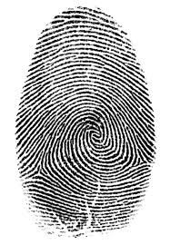
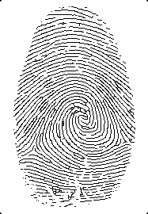

<h1 align="center">Go Image Skeleton</h1>

<p align="center">
  <a href="/LICENSE"></a>
  <a href="https://goreportcard.com/report/github.com/danilovkiri/go-image-skeleton"></a>
  <a href="https://app.fossa.com/projects/git%2Bgithub.com%2Fdanilovkiri%2Fgo-image-skeleton?ref=badge_shield" alt="FOSSA Status"></a>

</p>

<p align="center">
  An image skeletonization CLI tool
</p>

<br>

## Description

This project provides CLI functionality for image binarization via
[Bradley-Roth](https://doi.org/10.1080/2151237X.2007.10129236) and thinning via
[Zhang-Suen](https://dl.acm.org/doi/pdf/10.1145/357994.358023).

## Installation

Use `go install` to install go-image-skeleton.

```shell
go install github.com/danilovkiri/go-image-skeleton/cmd@latest
```

## Usage

The `--debug` flag is optional and will result in printing out the image matrices per each Zhang-Suen iteration
if invoked, `--input` is required.

```shell
go-image-skeleton --debug --input /path/to/input.png --output /path/to/output.png --workers 8
```

## Example

The left image represents the original fingerprint image with the right being its skeleton.

<p>
  
   
</p>
